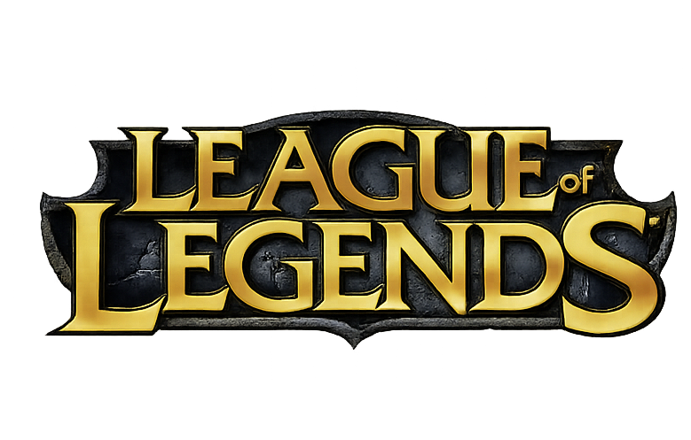
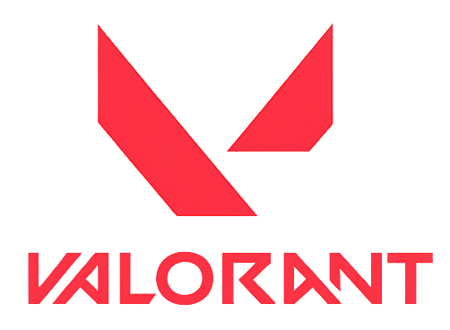
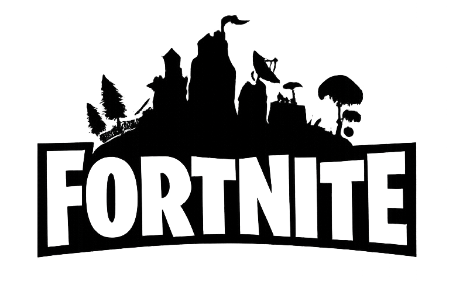
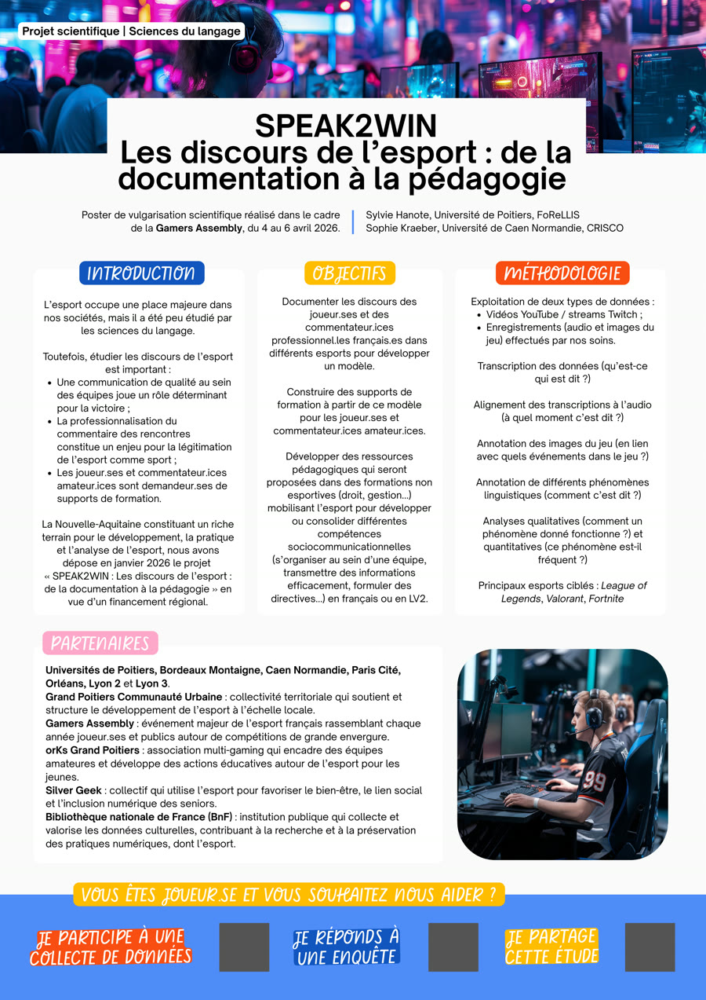

::: {.page-shell}
::: {.page-header}

Le projet

# Speak2Win en détail

Speak2Win documente les interactions de jeu et de commentaire afin de produire à la fois des connaissances scientifiques et des supports pédagogiques. Cette page regroupe la présentation complète du projet.
:::

::: {#projet .feature-grid}
::: {.poster-card}

Contexte

L'esport occupe une place majeure dans nos sociétés, mais il a été peu étudié par les sciences du langage.

::: {.poster-block}

Pourquoi étudier ces discours ?

- Une communication de qualité au sein des équipes joue un rôle déterminant pour la victoire.
- La professionnalisation du commentaire des rencontres constitue un enjeu pour la légitimation de l'esport comme sport.
- Les joueur.ses et commentateur.ices amateur.ices sont demandeur.ses de supports de formation.
:::

La Nouvelle-Aquitaine constitue un terrain privilégié pour le développement, la pratique et l'analyse de l'esport. Le projet a été déposé en janvier 2026 en vue d'un financement régional.

:::

::: {.poster-card}

Objectifs

Le projet articule recherche, formation et transfert pédagogique.

::: {.poster-block}

Trois objectifs structurants

- Documenter les discours des joueur.ses et des commentateur.ices professionnel.les français.es dans différents esports pour développer un modèle.
- Construire des supports de formation à partir de ce modèle pour les joueur.ses et commentateur.ices amateur.ices.
- Développer des ressources pédagogiques proposées dans des formations non esportives.
:::

Les compétences visées incluent l'organisation d'équipe, la transmission d'information et la formulation de directives en français ou en LV2.

:::

::: {.poster-card}

Corpus

La méthode combine constitution de corpus, annotation multimodale et analyse linguistique.

::: {.poster-block}

Sources et traitements

- Vidéos YouTube et streams Twitch.
- Enregistrements audio, vidéo et images du jeu effectués par nos soins.
- Transcription, alignement audio, annotation des images du jeu et annotation de phénomènes linguistiques.
- Analyses qualitatives et quantitatives.
:::

Principaux esports ciblés : League of Legends, Valorant, Fortnite.

::: {.esport-icon-grid}
::: {.esport-icon-card}
{.esport-icon-image alt="Logo League of Legends"}

League of Legends

:::

::: {.esport-icon-card}
{.esport-icon-image .esport-icon-image-valorant alt="Logo Valorant"}

Valorant

:::

::: {.esport-icon-card}
{.esport-icon-image alt="Logo Fortnite"}

Fortnite

:::
:::
:::
:::

::: {.spotlight-panel}

Pourquoi ce projet compte

::: {.spotlight-grid}
::: {.spotlight-card}
### Pour la recherche

Speak2Win documente un terrain encore peu couvert par les sciences du langage et produit un modèle d'analyse transférable à plusieurs jeux et formats de diffusion.
:::

::: {.spotlight-card}
### Pour les pratiques amateures

Le projet vise des ressources directement utiles aux joueur.ses et commentateur.ices qui souhaitent structurer leurs échanges, commenter plus clairement et progresser collectivement.
:::

::: {.spotlight-card}
### Pour la pédagogie

Les résultats pourront être réemployés dans des formations en droit, gestion ou langues pour travailler la coordination, la circulation de l'information et la formulation de consignes.
:::
:::
:::

::: {.partners-panel}

Partenaires et terrain

Le projet s'appuie sur un réseau universitaire et associatif large, avec un ancrage fort en Nouvelle-Aquitaine et un lien direct avec la Gamers Assembly 2026.

  
<strong>Universités</strong>Poitiers, Bordeaux Montaigne, Caen Normandie, Paris Cité, Orléans, Lyon 2 et Lyon 3.

  
<strong>Grand Poitiers Communauté Urbaine</strong>Soutient et structure le développement de l'esport à l'échelle locale.

  
<strong>Gamers Assembly</strong>Événement majeur de l'esport français, terrain privilégié pour la vulgarisation et la collecte.

  
<strong>orKs Grand Poitiers</strong>Association multi-gaming engagée dans l'encadrement amateur et l'éducation par l'esport.

  
<strong>Silver Geek</strong>Collectif mobilisant l'esport pour le bien-être, le lien social et l'inclusion numérique des seniors.

  
<strong>BnF</strong>Institution qui collecte et valorise les données culturelles liées aux pratiques numériques, dont l'esport.

:::

::: {.poster-showcase}
::: {.poster-copy}

Aperçu du poster

Retrouvez le poster expliquant notre démarche. Le document est disponible au téléchargement.
:::

{.poster-image alt="Aperçu du poster scientifique Speak2Win"}
:::

::: {.hero-actions}
[Télécharger le poster PDF](Poster scientifique.pdf){.button-link .button-primary}
[Accéder au formulaire](formulaire.html#participer-formulaire){.button-link .button-soft}
:::

::: {.wide-panel}

Méthode

::: {.poster-block}

Comment nous traitons notre corpus ?

- Alignement des transcriptions à l’audio 
(*à quel moment c’est dit ?*)
- Annotation des images du jeu 
(*en lien avec quels événements dans le jeu ?*)
- Annotation de différents phénomènes linguistiques 
(*comment c’est dit ?*)
- Analyses qualitatives 
(*comment un phénomène donné fonctionne ?*)
- Analyses quantitatives 
(*ce phénomène est-il fréquent ?*)
:::
:::

::: {.participate-panel}

Vous êtes joueur.se et vous souhaitez nous aider ?

::: {.participate-grid}
::: {.action-card}
### Je participe à une collecte de données

Contribuez à la constitution du corpus via des sessions enregistrées et des extraits de jeu commentés.
:::

::: {.action-card}
### Je réponds à une enquête

Partagez vos habitudes de jeu, vos usages langagiers et vos attentes en matière de formation.
:::

::: {.action-card}
### Je partage cette étude

Diffusez le projet auprès de vos équipes, associations, communautés et structures partenaires.
:::
:::

  <a class="button-link button-primary" href="formulaire.html#participer-formulaire">Accéder à la page formulaire</a>
  <a class="button-link button-soft" href="Poster%20scientifique.pdf">Consulter le poster PDF</a>

:::
:::
